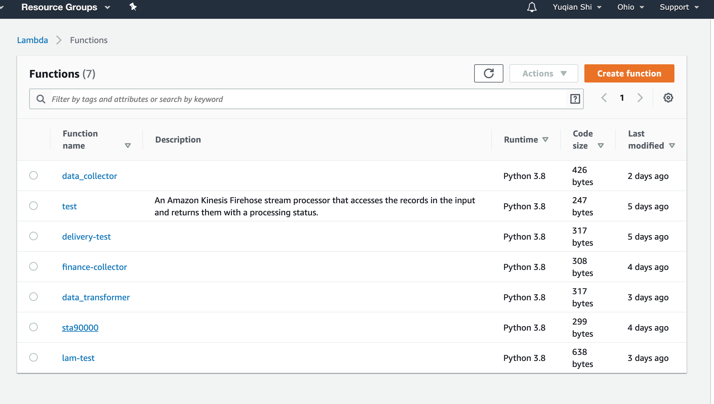

## Lambda function URL

https://0xcc27bili.execute-api.us-east-2.amazonaws.com/default/sta90000


----

## a screenshot of the kinesis firehose delivery stream 


----


## result.csv/query.sql

### sql

```SQL
select max(high) as max_high,name,hours from json_yuqian group BY name,hours order by name,hours
```


### screenshot


----

> Notice: First I have to say sorry, because my Kinesis configuration has always been ineffective, so that I used pyspark for data analysis(Analysis.ipynb), and uploaded the collected data set to s3 (json format), and used Athena and glue to query the data. The result is as expected.

